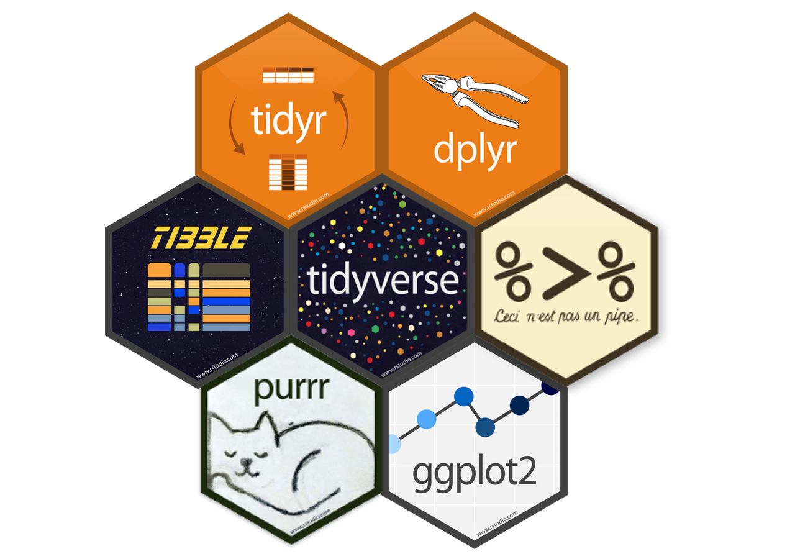

```{r setup, include=FALSE}
knitr::opts_chunk$set(echo = FALSE)
```

<!-- Pull in Droid Serif google font -->
<link href="https://fonts.googleapis.com/css?family=Droid+Serif:400,400i,700" rel="stylesheet">

## Who are you?

<iframe src="https://embed.polleverywhere.com/multiple_choice_polls/z2igyt98dIf28hI?controls=none&short_poll=true" width="100%" height="600px" frameBorder="0"></iframe>

## For those that must be different...

<iframe src="https://embed.polleverywhere.com/free_text_polls/B3QNu9te4vgKhsC?controls=none&short_poll=true" width="100%" height="100%" frameBorder="0"></iframe>

## Regardless of reason...

...why you're here, this session will:

- Introduce you to data science
- Introduce you to R
- Discuss some state-of-the-art tools for classroom use

## Open Presentation

- Go to GitHub
- Create an account
- Search for "mdlama/qbio17"
- Fork!
- Go to RStudio Server
- Create new project from repo
- Open presentation and knit: Boom!

## Vision for a data science course

<div class="columns-2">
(based on [talk](https://github.com/mine-cetinkaya-rundel/2017-07-05-teach-ds-to-new-user) by [Mine Çetinkaya-Rindel](http://www2.stat.duke.edu/~mc301/) at [useR2017](https://user2017.brussels/))

- modern
- put data front and center
- quantitative (but not *mathematical*)
- different than high school stats
- challenging (but not *intimidating*)


</div>

## Vision for a data science course | Emphasize modern, multivariate exploratory data analysis and data visualization

```{r, echo=F, message=F, fig.height=4}
library(plotly)
set.seed(100)
d <- diamonds[sample(nrow(diamonds), 1000), ]
plot_ly(d, x = ~carat, y = ~price, color = ~carat,
        size = ~carat, text = ~paste("Clarity: ", clarity))
```

<div class="footer">
Based on [talk](https://github.com/mine-cetinkaya-rundel/2017-07-05-teach-ds-to-new-user) by [Mine Çetinkaya-Rindel](http://www2.stat.duke.edu/~mc301/)
</div>

## Vision for a data science course | Teach the data life cycle


Important missing piece:  *Where does the data come from?* (e.g. **Experimental Design**)

<div class="footer">
Based on [talk](https://github.com/mine-cetinkaya-rundel/2017-07-05-teach-ds-to-new-user) by [Mine Çetinkaya-Rindel](http://www2.stat.duke.edu/~mc301/)
</div>

## Vision for a data science course | Teach (not just expect) reproducible computation


<div class="footer">
Based on [talk](https://github.com/mine-cetinkaya-rundel/2017-07-05-teach-ds-to-new-user) by [Mine Çetinkaya-Rindel](http://www2.stat.duke.edu/~mc301/)
</div>

## Vision for a data science course | Approach statistics from a model based perspective

<div class="footer">
Based on [talk](https://github.com/mine-cetinkaya-rundel/2017-07-05-teach-ds-to-new-user) by [Mine Çetinkaya-Rindel](http://www2.stat.duke.edu/~mc301/)
</div>

## Vision for a data science course | Pedagogical recommendations

- Encourage and enforce working collaboritavely (think, code, write, present)
- Underscore effective communication of findings
- **Ask questions students want to answer**
- **Equip students with the tools to answer questions of their own choosing**

<div class="footer">
Based on [talk](https://github.com/mine-cetinkaya-rundel/2017-07-05-teach-ds-to-new-user) by [Mine Çetinkaya-Rindel](http://www2.stat.duke.edu/~mc301/)
</div>

## What is data science anyways?

<a href="https://mixpanel.com/blog/2016/03/30/this-is-the-difference-between-statistics-and-data-science/">This is the difference between statistics and data science</a>, by Justin Megahan

> "And there is certainly no lack of demand for data scientists. A few months ago, Glassdoor named it the top job of 2016 – with more than 1,700 job openings and an average salary of $116k." <br \> <span style="float:right;"> - Justin Megahan</span>

<p></p>
> "There have been calls to do more in the statistics community, to expand its boundaries, to look more to data collection, management, and presentation, to focus more on predicting future outcomes and less on merely inferring relationships." <br \> <span style="float:right;"> - Justin Megahan</span>

## What is data science anyways?

<div class="centered">
Data science is:<br \><br \> Applied stat<br \> Data skills<br \> Computational skills
</div>

## Data science is everywhere | New York Times

<div class="centered">
<a class="image-border" href="https://www.nytimes.com/interactive/2016/09/04/science/global-warming-increases-nuisance-flooding.html">

</a>
</div>

## Data science is everywhere | Wall Street Journal

<div class="centered">
<a class="image-border" href="http://graphics.wsj.com/infectious-diseases-and-vaccines/">

</a>
</div>

## Data viz for journalists

<div class="centered">
<a class="image-border" href="https://www.tableau.com/">

</a>

### For educational use:

<a class="image-border" href="https://public.tableau.com/s/">

</a>
</div>

## What about for biology?

<div class="centered">
<a class="image-border" href="https://www.datacamp.com/community/tutorials/r-or-python-for-data-analysis">

</a>
</div>

<div class="footer">
[Infographic](https://www.datacamp.com/community/tutorials/r-or-python-for-data-analysis) by Karlijn Willems @ DataCamp
</div>

## Why scripting languages over GUIs? | Reproducibility, Collaboration, Open Source and Versioning

*Our path to better science in less time using open data science tools* ([Lowndes et al., 2017](https://www.nature.com/articles/s41559-017-0160))

> "Coding is 'as important to modern scientific research as telescopes and test tubes'$^1$, but it is critical to 'dispel the misconception that these skills are intuitive, obvious, or in any way inherent'$^2$".

<div class="footer">
$^1$ Wilson, G. et al. Best practices for scientific computing. PLoS Biol. 12, e1001745 (2014).<br \>
$^2$ Mills, B. Introducing mozilla science study groups. Mozilla (22 April 2015).
</div>

## Open science challenges

Reasons researchers do not publish reproducibly ([Borgman, 2007](http://www.dlib.org/dlib/january17/nuest/01nuest.html)):

- a lack of incentives in terms of citations or promotion
- the effort required to clean data and codes
- the creation of a competitive advantage over other fellows
- intellectual property issues

<div class="centered">
<a class="image-border" href="https://cos.io/">

</a>
</div>

## Where can I learn/practice my skills?

<a class="image-border" href="https://www.datacamp.com/groups/education">

</a>

DataCamp is free for every participant during the Summer Workshop!!

<a href="https://www.datacamp.com/groups/08e4a1a457e123fb3e4e49a9a66d18d7e760d6e3/invite">Click to join group</a>

## DataCamp curriculum

<div class="centered">
<a class="image-border" href="https://qubeshub.org/blog/2017/05/using-datacamp-to-help-teach-data-science-in-a-biostatistics-class">

</a>
</div>

<div class="footer">
Image from blog https://qubeshub.org/blog/2017/05/using-datacamp-to-help-teach-data-science-in-a-biostatistics-class
</div>

## DataCamp curriculum | [tidyverse](http://tidyverse.org)

<div class="centered">

</div>

<div class="footer">
[Teach the tidyverse to beginners](http://varianceexplained.org/r/teach-tidyverse/), by David Robinson ([\@drob](https://twitter.com/drob))
</div>

## Step 1: Data Wrangling {.vcenter .flexbox}


<div class="footer">
[http://r4ds.had.co.nz/wrangle-intro.html](R for Data Science, Part II: Wrangle), by Garrett Grolemund and Hadley Wickham
</div>

## tidyverse | Importing Data

<div class="centered">
<a class="image-border" href="https://www.datacamp.com/community/tutorials/r-data-import-tutorial#gs.bsktf80">

</a>
</div>

<span style="position: absolute; top: 40px; right: 60px; height: 100px;">
<a class="image-border" href="http://readr.tidyverse.org/"></a>
<a class="image-border" href="http://readxl.tidyverse.org/"></a>
<a class="image-border" href="http://haven.tidyverse.org/"></a>
<a class="image-border" href="https://www.datacamp.com/courses/importing-data-in-r-part-1"></a> 
<a class="image-border" href="https://www.datacamp.com/courses/importing-data-in-r-part-2"></a> 
</span>

<div class="footer">
Image from [This R Data Import Tutorial Is Everything You Need](https://www.datacamp.com/community/tutorials/r-data-import-tutorial#gs.bsktf80) by Karlijn Willems
</div>

## tidyverse | Data cleaning with tidyr

<div class="centered">


</div>

<span style="position: absolute; top: 40px; right: 60px; height: 100px;">
<a class="image-border" href="http://tidyr.tidyverse.org/"></a>
<a class="image-border" href="https://www.datacamp.com/courses/cleaning-data-in-r"></a> 
</span>

<div class="footer">
From presentation [UBC STAT545 2015 cm103 Data cleaning via Gapminder](https://speakerdeck.com/jennybc/ubc-stat545-2015-cm103-data-cleaning-via-gapminder) <br \>by Jenny Bryan ([\@jennybryan](https://twitter.com/jennybryan))
</div>

## tidyverse | Data manipulation with dplyr

<div class="centered">

</div>

<span style="position: absolute; top: 40px; right: 60px; height: 100px;">
<a class="image-border" href="http://dplyr.tidyverse.org/"></a>
<a class="image-border" href="https://www.datacamp.com/courses/dplyr-data-manipulation-r-tutorial"></a> 
<a class="image-border" href="https://www.datacamp.com/courses/joining-data-in-r-with-dplyr"></a> 
</span>

<div class="footer">
From presentation by Hadley Wickham ([\@hadleywickham](https://twitter.com/hadleywickham))
</div>

## Step 2: Data Visualization {.vcenter .flexbox}


<div class="footer">
[http://r4ds.had.co.nz/explore-intro.html](R for Data Science, Part I: Explore), by Garrett Grolemund and Hadley Wickham
</div>

## tidyverse | Visualizing data with ggplot2

<div class="centered">

</div>

<span style="position: absolute; top: 40px; right: 60px; height: 100px;">
<a class="image-border" href="http://ggplot2.tidyverse.org/"></a>
<a class="image-border" href="https://www.datacamp.com/courses/data-visualization-with-ggplot2-1"></a> 
<a class="image-border" href="https://www.datacamp.com/courses/data-visualization-with-ggplot2-2"></a> 
<a class="image-border" href="https://www.datacamp.com/courses/data-visualization-with-ggplot2-part-3"></a> 
</span>

## The Carpentries

<div class="centered">

</div>

> "Our mission is to provide **researchers** high-quality, domain-specific training covering the full lifecycle of data-driven research." <br \> <span style="float:right;"> - Data Carpentry</span>

<div class="footer">
[Data Carpentry](https://www.datacarpentry.org/) and [Software Carpentry](https://software-carpentry.org/)
</div>

## Data Science in the Classroom | Software Tools

<div class="centered">

</div>

## Software Tools on QUBES

> - **Jupyter Notebooks**: [Launch on QUBES](https://qubeshub.org/tools/jupyter/invoke)
> - **RStudio**: [Launch on QUBES](https://qubeshub.org/tools/rstudio/invoke)
> - **Serenity**: [Launch on QUBES](https://qubeshub.org/tools/serenity/invoke)